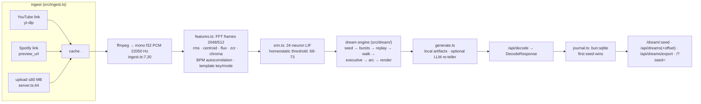

# Architecture

Reverse-documented from the code on 2026-10-02; every claim cites
`path:line`. When code and this doc disagree, the code is right and this
doc is the bug — fix it in the same commit that changes the behavior.

## 1. Shape of the system

Two runtimes, one product:

- **Origin** — `src/server.ts`, a Bun HTTP app that does all real work:
  ingest → DSP → spiking network → dream synthesis → artifacts. Runs
  entirely locally; no account, no telemetry.
- **Edge** — `cloudflare/src/index.ts`, a Hono Worker adapted from
  Cloudflare's x402-proxy-template (MIT): payment gate in front of the
  origin, D1 dream permalinks, R2 audio. **Prepared, not deployed**
  (blocked on a `cfut_` token; see HANDOFF T1).

## 2. Module map (origin)

| Module | Responsibility | Evidence |
|---|---|---|
| `src/server.ts` | HTTP routing, payment gate seam, journal write, frame downsampling to ≤1500 for responses | `:97-152`, `:86-95` |
| `src/ingest.ts` | three source kinds → `{id,title,samples,sampleRate}`; ffmpeg `-f f32le -ac 1 -ar 22050` | `:30`, `TARGET_RATE :7`, `<0.5 s` rejected `:36` |
| `src/dsp.ts` | FFT + Hann window, hashing primitives | used by features.ts |
| `src/features.ts` | per-frame features + track profile: BPM + `bpmConfidence` — chosen autocorrelation peak over onset energy (`estimateBpm :89-134`, confidence `:128-131`), key/mode by major/minor template correlation (`:156-166`), valence/arousal (`:175-176`), `signature` fnv1a hash (`:178-180`) | frame 2048/hop 512 `:4-5` |
| `src/snn.ts` | leaky-integrate-and-fire net, `NEURONS = 24` (`:4`); constants hardcoded `:5-9`; audio enters as 4 channels `:35-40`; PRNG-seeded weights `:12,:18` | `SpikeState = {rates, meanRate, sync, raster≤4000}` types.ts:32-37 |
| `src/dream/` | the mechanism engine (see §3) | — |
| `src/generate.ts` | orchestrates `runDream`, optional LLM re-teller (see §5) | gate `:26-28` |
| `src/journal.ts` | `bun:sqlite` dream store, WAL, `INSERT OR IGNORE` (first seed wins) | tested `tests/journal.test.ts` |
| `src/payments/` | dormant x402 gate (`off`/`mock`/`x402-testnet`) — slated for deletion at the edge (T2) | seam symbols in server.ts `:15-22,:101-110` |
| `public/` | vanilla JS glassmorphic UI; journal panel, `/?seed=` permalinks | — |

## 3. Dream engine — mechanism-inspired synthesis

The engine models sleep-dreaming mechanisms. It does **not** understand
music, and copy must never claim it does (ADR-002, README contract).

| Primitive | Mechanism | Where | Measured fact |
|---|---|---|---|
| Seed (recall) | crypto entropy → 8-hex `dreamSeed`; replay = same bits | `seed.ts:1,19-23`; folded at `engine.ts:90` | pattern `[0-9a-f]{8,32}` |
| M1 phasic bursts | fire on spectral-flux peaks with refractory spacing | `dream/bursts.ts` | phosphene strip `bursts.ts:108-117`, ramp `" ·░▒▓█"`, 24 chars = one per neuron |
| M2 emotion-tagged replay | affect-weighted fragment selection, never-zero tail | `dream/replay.ts` | bank **435 fragments**, 929 undirected edges, 11.95 % weak links (`w≤0.25`), 89-entry remote tail (`bank.ts:627-718`) |
| M3 executive collapse | `execIndex = clamp01(0.78 − chaos·0.7 + sync·0.12)` | `dream/executive.ts:48` | chaos = zcr-std·3.2 + dynamism·0.35 `:31-44` |
| M4 hyperpriming walk | follows weak remote edges, capped teleports | `dream/walk.ts` | budget tracks dynamism (`tests/dream-mechanisms.test.ts`) |
| M5 tension arc | threat-simulation narrative shape | `dream/arc.ts` | — |
| M6 day residue | phonemes folded from loudness onsets + centroid vowels — never the title | `dream/residue.ts` | ≤2 lowercase syllables (`tests:61-77` area) |
| M7 reconstructive recall | clear/hazy/gone fade then re-recall into idea/script/prompt | `dream/render.ts:58-68,128` | `recallConfidence = clear/nodes` |
| M8 hypnagogic layer | firing rates rendered directly (sigil raster + phosphene) | `snn.ts` raster, `bursts.ts` | — |

Containment invariant (tested corpus-wide): artifacts may only mention
fragments the dream actually walked — `tests/dream-render.test.ts`
cross-artifact containment, 30-seed sweep.

## 4. Contracts: origin routes

| Route | Method | Behavior | Evidence |
|---|---|---|---|
| `/api/decode` | POST | multipart upload or `{"url"}` (+optional `dreamSeed`); gate-checked when `JUKEBOX_PAYMENTS≠off`; IngestError→400, else 500; journal write is best-effort — a broken store is a logged miss, never a failed decode | `server.ts:36-84,99-117` |
| `/dream/:seed` | GET | journal replay of the stored payload, `cache-control: public, max-age=31536000, immutable`; 404 names the seed (input already hex-validated) | `server.ts:118-125` |
| `/api/dreams` | GET | newest-first index, `limit` default 50 clamped 1..500, `offset` clamped ≥0 | `server.ts:135-140`, `journal.ts:73-80` |
| `/api/dreams/export` | GET | whole journal as NDJSON (one stored response per line), attachment disposition, unpaged by design | `server.ts:126-133`, `journal.ts:87-93` |
| `/audio/:id` | GET | cached file from `CACHE_DIR`, `accept-ranges: bytes` | `server.ts:142-153` |
| `/`, static | GET | `public/` with path sanitization | `server.ts:154-163` |

Fresh-by-default: the server always supplies `freshDreamSeed()` unless the
client passes one (`server.ts:66`); the signature-derived fallback seed
(`engine.ts:46-48`) only fires for direct library calls, never HTTP.

## 5. LLM re-teller (optional, honest fallback)

`generate.ts:26-37`: needs `OPENAI_API_KEY` + `JUKEBOX_LLM_MODEL`
(± `OPENAI_BASE_URL`); `temperature 1.1`, JSON response mode. The brief
asks for nothing more than re-telling the already-walked fragments in
better prose (`generate.ts:42`). Machine-owned facts — scene graph,
`dreamSeed`, every measured value — are **never** delegated to the LLM;
on any failure (missing env, HTTP ≥400, malformed JSON, throw) the engine
silently returns local artifacts with `engine: "local"`
(`generate.ts:48-63`, mocked tests in `tests/generate-llm.test.ts`).

## 6. Storage layers

| Store | Engine | Schema / key | Semantics |
|---|---|---|---|
| Origin journal | `bun:sqlite` (`.data/dreams.db`, `JUKEBOX_DATA_DIR`) | `dreams(seed PK, title, artifacts, created_at)` | WAL; `INSERT OR IGNORE` — **first seed wins**, replays never clobber (`journal.ts recordDream`) |
| Edge permalinks | D1 | identical table (`cloudflare/schema.sql`) | `ON CONFLICT DO UPDATE` — edge overwrites; divergence is deliberate (edge records paid decodes as they pass, `index.ts:66-79`) |
| Edge audio | R2 | `<id>` or `<id>.<ext>` lookup | falls through to origin while bucket empty (`index.ts:136-153`) |

Planned change (T1): D1-miss should fall through to the origin journal —
recorded in HANDOFF-T1, not yet implemented.

## 7. Determinism invariants

1. Same `(seed, decoded signal)` → byte-identical artifacts. Proven by
   `tests/generate.test.ts` ("recalling the emitted seed replays the
   byte-identical dream") and the 4/4 byte-identical session recalls in
   `docs/DREAM-LISTENING.md`.
2. Every randomness stream is seeded: SNN PRNG from the profile signature
   or explicit seed (`snn.ts:12`), engine per-stage rng streams
   (`engine.ts:24-26`).
3. Audio, never metadata: title only feeds the profile `signature` hash
   (`features.ts:178-180`); residue reads only the decoded signal (M6).

## 8. Payments architecture (current and intended)

Today the gate exists in **both** runtimes by design overlap: origin
`src/payments/` (modes `off`/`mock`/`x402-testnet`, watch/settle-only —
the server never holds a private key, `JUKEBOX_PAY_TO` is a public
address) and edge `x402-hono` middleware (`cloudflare/src/auth.ts:28-60`,
cookie-or-payment). The intended end state (T2): edge gates, origin runs
`JUKEBOX_PAYMENTS=off` with its seam deleted — the decommission runbook
lives in `docs/HANDOFF-PROMPTS.md` T2. Never ship a moment with zero
gates on a public origin: edge-live first, seam-last.

## 9. Why the CI looks unusual

`pull_request` triggers are absent on purpose and every workflow pins
`[self-hosted, jukebox-ci]`: the account's billing lock starves
GitHub-hosted jobs, and fork code must never execute on the box. PR
verification is a human-invoked local replay (`scripts/pr-check.ts`),
CodeQL is a self-hosted job, not default setup. Full reasoning:
ADR-004 / ADR-005 in `docs/adr/`.
